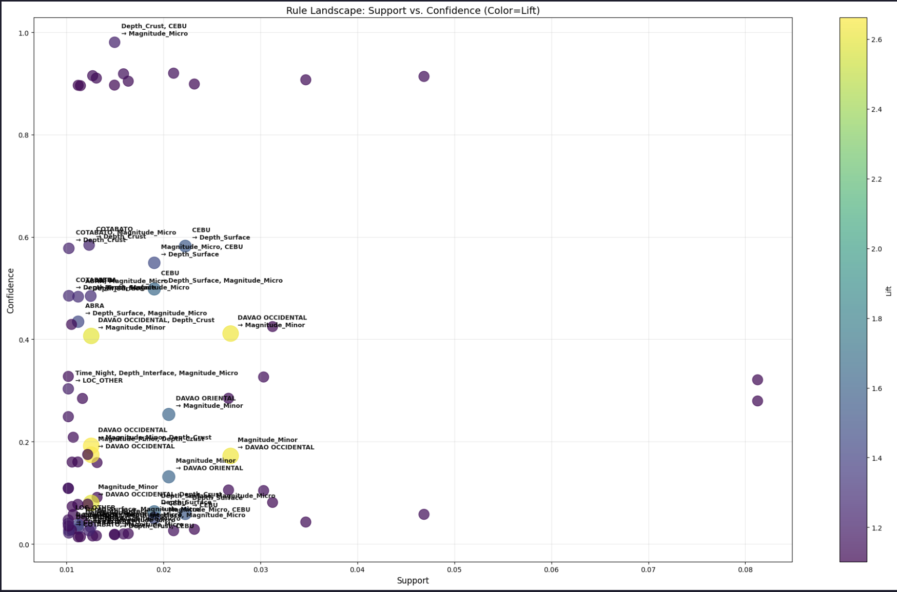
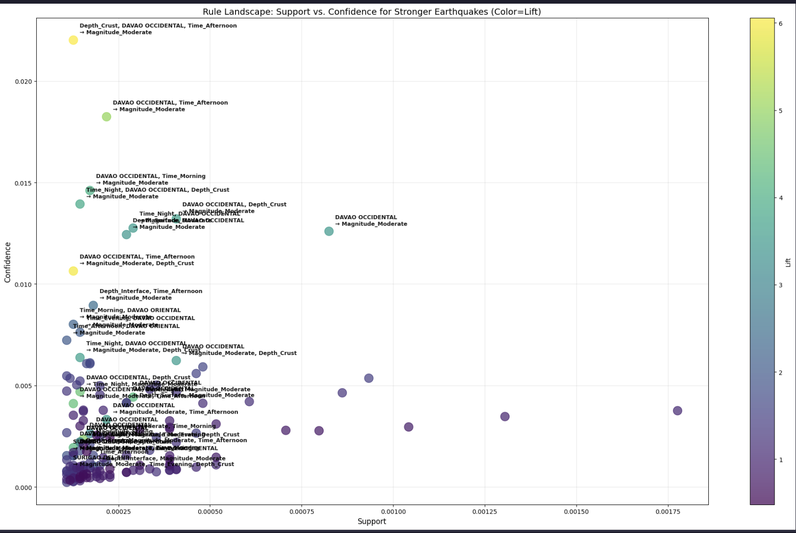

# Association Rule Mining on Philippine Earthquake Clusters (2019-2025)
**CSC172 Data Mining Final Project** *Mindanao State University - Iligan Institute of Technology* **Student:** John Christian Niño T. Abuel  
**Semester:** AY 2025-2026 Sem 1

[](https://python.org)
[](https://opensource.org/licenses/MIT)
[]()

## Abstract
The Philippines is a seismically active archipelago, yet standard monitoring often focuses on frequency counts rather than behavioral patterns. This project utilizes **Association Rule Mining (Apriori Algorithm)** on Modern Earthquake Data obtained by the Philippine Institute of Volcanology and Seismology (PHIVOLCS) (2019–2025). By implementing Apriori twice on different parameters, the study successfully differentiates between low-risk "Swarm Zones" (e.g., Cebu, Batangas) and high-energy "Hazard Zones" (Davao Occidental, Surigao del Sur and surrounding provinces). The analysis uncovers distinct "Seismic Identities," moving beyond simple hazard maps to reveal the probabilistic rules regarding regional earthquake activity.

## Table of Contents
- [Introduction](#introduction)
- [Related Work](#related-work)
- [Methodology](#methodology)
- [Experiments & Results](#experiments--results)
- [Discussion](#discussion)
- [Ethical Considerations](#ethical-considerations)
- [Conclusion](#conclusion)
- [Installation](#installation)
- [References](#references)

## Introduction
### Problem Statement
Seismic data is often presented as isolated points on a map (hypocenters). While this indicates *where* earthquakes happen, it fails to capture *how* they behave. Does a region experience harmless micro-swarms, or is it statistically prone to destructive high-energy release? Standard statistical analysis often buries rare, high-magnitude seismic activity under the noise of thousands of micro-earthquakes, creating a "blind spot" for major hazard detection. This also poses a problem for people that try to settle into an area, where significant seismic activities may affect property/infrastructure development. 

### Objectives
- **Bin & Transform:** Convert continuous physics data (Magnitude, Depth, Time) and the location (Province), into categorical "seismic baskets" suitable for rule mining.
- **Dual-Pass Mining:** Implement a two-tiered Apriori approach to overcome the Gutenberg-Richter Law:
    - *Pass 1:* Detect high-frequency swarm behaviors.
    - *Pass 2:* Detect rare, high-impact events (Moderate/Strong quakes).
- **Profile Risk:** Classify provinces into "Swarm Zones" vs. "Hazard Zones" based on Lift and Confidence metrics.
- **Visualize:** Map the "Rule Landscape" using graphs and scatter plots.

## Related Work
- *PHIVOLCS (Philippine Institute of Volcanology and Seismology).* Annual Seismic Bulletins. (Provides the raw data but primarily focuses on descriptive statistics).
- *Gutenberg, B., & Richter, C. F. (1954).* Seismicity of the Earth and Associated Phenomena. (Establishes the frequency-magnitude power law, which this project addresses algorithmically).
- *Agrawal, R., & Srikant, R. (1994).* Fast algorithms for mining association rules. (The foundational text for the Apriori algorithm used here).

*(GAP: While seismology uses physics-based models, few studies apply Association Rule Mining to create probabilistic risk profiles for specific Philippine provinces.)*

## Methodology
### Dataset
- **Source:** PHIVOLCS Consolidated Data from Kaggle (2016 - 2025) Link: https://www.kaggle.com/datasets/bwandowando/philippine-earthquakes-from-phivolcs
- **Period:** 2019–2025 (Selected to capture the modern tectonic stress cycle post-2019 Cotabato series and upgraded sensor networks).
- **Preprocessing:**
    - **One-Hot Encoding:** Converted categorical data into binary vectors.
    - **Binning Strategy:**
        - *Magnitude:* Micro (<3), Minor (3-4.9), Moderate (5-5.9), Strong (6+).
        - *Depth:* Surface (0-15km), Crust (15-40km), Interface (40-120), Deep (>40km).
        - *Time:* Morning, Afternoon, Evening, Night.
        - *Place:* Top 20 Seismically Active Provinces, other provinces = LOC_OTHER.

### Dual-Pass Apriori Strategy

| Parameter | Pass 1 (Swarms) | Pass 2 (Big Quakes) |
|-----------|-----------------|---------------------|
| **Objective** | Find common, low-risk patterns | Find rare, high-risk hazards |
| **Min Support** | `0.01` (1%) | `0.0001` (0.01%) |
| **Lift Threshold** | `> 1.1` | `> 1.0` (Sorted by Max Lift) |
| **Outcome** | 80 High-Confidence Rules | 148 High-Lift Rules |

### Implementation Code Snippet
```python
## Swarms
frequent_itemsets = apriori(df_encoded, min_support=0.01, use_colnames=True)

# Generate Rules
rules = association_rules(frequent_itemsets, metric="lift", min_threshold=1.1)

# Sort by Lift (Strength of Association)
rules = rules.sort_values('lift', ascending=False)

## Strong earthquakes
frequent_items = apriori(df_encoded, min_support=0.0001, use_colnames=True)

# Generate Rules
rules = association_rules(frequent_items, metric="lift", min_threshold=1.0)

targets = ['Magnitude_Moderate', 'Magnitude_Strong', 'Magnitude_Major']
big_quake_rules = rules[rules['consequents'].apply(lambda x: any(t in list(x) for t in targets))]
```

### Demo


[Video: [CSC173_YourLastName_Final.mp4](demo/CSC172_Abuel_Final.mp4)] [web:41]

## Discussion
- Strengths: It allowed for the simultaneous analysis of common swarms and rare destructive events without one drowning out the other.
- Limitations: The study period (6 years) is short in geological terms. Provinces considered as "outliers" appeared as single rules, representing latent risk or specific aftershock sequences rather than established trends.
- Insights: The analysis proves that Eastern Mindanao (Davao/Surigao) possesses a fundamentally different "Seismic DNA" (High Energy/Trench-Driven) compared to the Visayas (Cebu/Bohol - Low Energy/Fracture-Driven).


## Experiments & Results
### Key Metrics & Findings

| Metric | Top Rule | Value | Insight |
|-------|---------|--------|---------|
| **Highest Lift** | `{Davao Occ, Afternoon} -> {Moderate Quake}` | **6.06** | Davao Occ is 6x more likely to have a significant quake than random chance. |
| **Highest Confidence** | `{Cebu, Depth_Crust} -> {Micro Quake}` | **0.98** (98%) | Cebu is a confirmed "Swarm Zone" dominated by micro-seismicity. |
| **Strongest Hazard** | `{Davao Occ} -> {Magnitude_Strong}` | **Lift: 4.81** | The only province with a direct rule predicting Magnitude 6+ events. |


## Ethical Considerations
- **Public Panic:** Misinterpreting "Lift" as a prediction of imminent doom could cause unnecessary panic. These rules are probabilistic profiles, not earthquake predictions.
- **Economic Impact:** Labeling specific provinces as "High Risk" could theoretically impact real estate values or insurance premiums. Results should be presented as a guide for engineering reinforcement, not economic red-lining.
- **Data Privacy:** Seismic data is public and non-personal, posing minimal privacy risks.

## Conclusion
Apriori Association Rule Mining was effectively applied to categorize Philippine seismicity. By statistically validating the distinction between **"Swarm Zones"** (Cebu, Batangas) and **"Hazard Zones"** (Davao Occidental, Surigao del Sur), this project provides a data-driven basis for disaster risk reduction. The findings suggest that while Cebu requires monitoring resources for frequent swarms, Davao Occidental and Surigao del Sur require prioritized engineering interventions to withstand confirmed high-energy crustal hazards.

## Installation
1. Clone repo: `git clone https://github.com/jhnabuel/CSC172-AssociationMining-Abuel.git`
2. Install dependencies: `pip install -r requirements.txt`
3. Run the analysis:
    - `ph_earthquake.ipynb` (Preprocessing & Visualization)
    - `apriori.ipynb` (Dual-Pass Mining)

**requirements.txt:**
```text
pandas
numpy
matplotlib
seaborn
mlxtend
scikit-learn
```
## References
[1] Agrawal, R., Imieliński, T., & Swami, A. (1993). Mining association rules between sets of items in large databases. ACM SIGMOD Record.

[2] PHIVOLCS. (2025). Philippine Earthquake Catalog.

[3] Raschka, S. (2018). MLxtend: Providing machine learning and data science utilities and extensions to Python's scientific computing stack. Journal of Open Source Software.